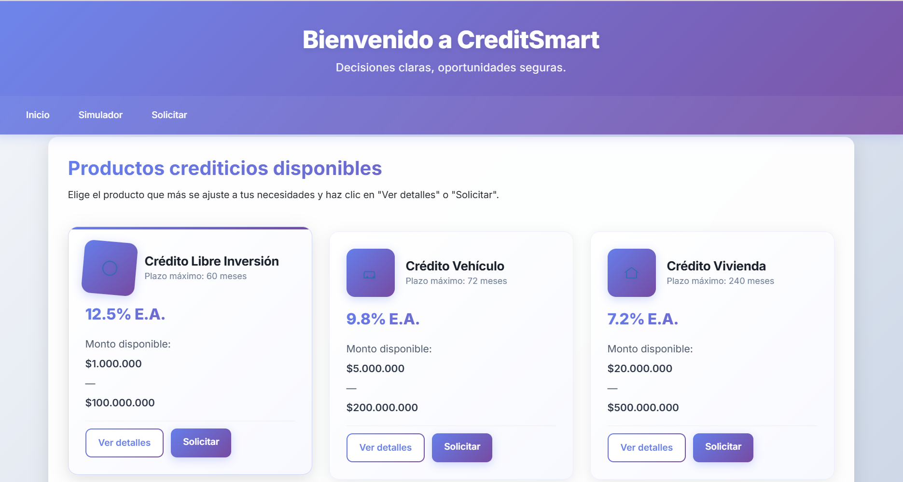
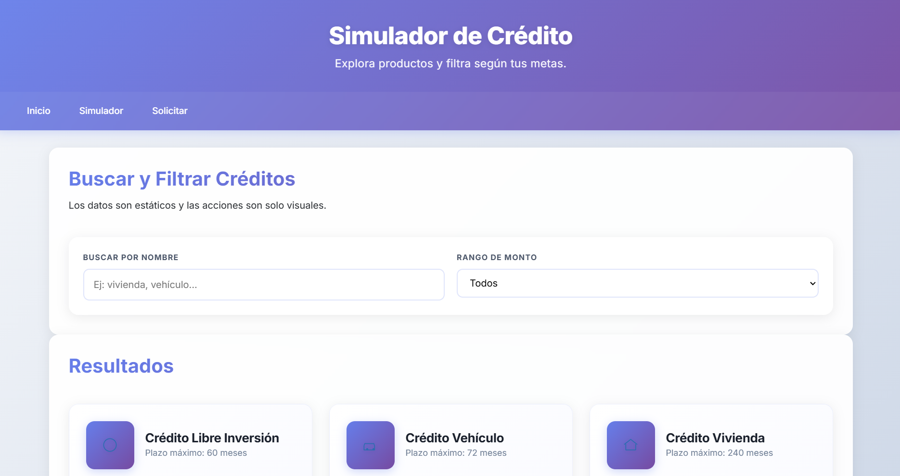
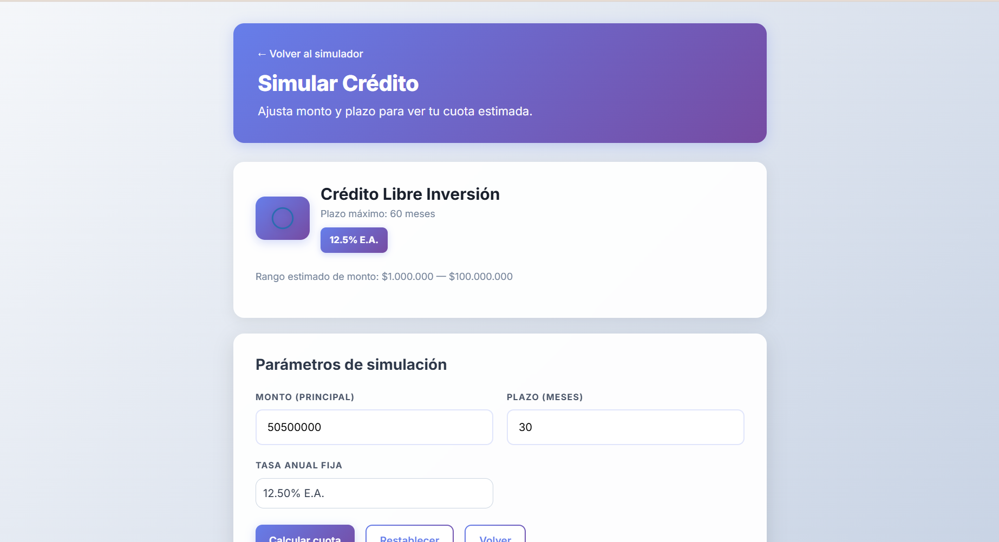
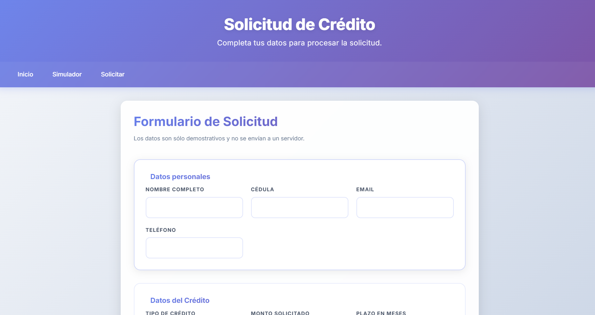

# CreditSmart - Plataforma de Créditos

**Estudiante:** Hernando Pérez  
**Institución:** IU Digital de Antioquia  
**Programa:** Ingeniería Web

## 📋 Descripción del Proyecto

CreditSmart es una aplicación web moderna para explorar, simular y solicitar productos crediticios. La plataforma ofrece una interfaz intuitiva y visualmente atractiva que permite a los usuarios:

- Explorar 5 productos crediticios diferentes (Vivienda, Vehículo, Personal, Educativo, Empresarial)
- Filtrar productos por nombre y rango de monto
- Simular créditos con cálculo de cuota mensual
- Solicitar créditos mediante formulario estructurado
- Visualizar requisitos y detalles de cada producto

El proyecto utiliza **diseño moderno** con gradientes, animaciones y efectos visuales profesionales, implementado con HTML5, CSS3 y JavaScript vanilla.

## 📁 Estructura de Archivos

```
CreditSmart/
│
├── index.html              # Página principal con catálogo de productos
├── simulador.html          # Buscador y filtros de productos
├── simular.html            # Calculadora de cuotas mensuales
├── solicitar.html          # Formulario de solicitud de crédito
├── README.md               # Documentación del proyecto
│
├── css/
│   ├── bootstrap.min.css   # Framework Bootstrap 5
│   └── styles.css          # Estilos personalizados modernos
│
├── js/
│   ├── bootstrap.bundle.min.js  # JavaScript de Bootstrap
│   ├── main.js             # Lógica de productos y modal (index)
│   ├── simulador.js        # Lógica de filtros (simulador)
│   ├── simular.js          # Cálculo de cuotas (simular)
│   └── solicitar.js        # Validación y prellenado (solicitar)
│
└── assets/
    └── images/             # Carpeta para imágenes (actualmente usa SVG inline)
```

## 🚀 Instrucciones para Ejecutar

### Opción 1: Abrir directamente (método simple)
1. Navegar a la carpeta del proyecto en el explorador de archivos
2. Hacer doble clic en `index.html`
3. El navegador abrirá la página principal

### Opción 2: Servidor local (recomendado)

**Usando Python 3:**
```powershell
cd "C:\Users\Herna\OneDrive - IU Digital de Antioquia\Ingenieria Web\CreditSmart"
python -m http.server 8000
```
Luego abrir en el navegador: **http://localhost:8000/index.html**

**Usando Node.js (si está instalado):**
```powershell
npx http-server -p 8000
```

**Usando Live Server (VS Code):**
1. Instalar la extensión "Live Server"
2. Clic derecho en `index.html`
3. Seleccionar "Open with Live Server"

## 🎨 Características de Diseño

- **Sistema de diseño moderno** con variables CSS y gradientes vibrantes
- **Fuente Inter** de Google Fonts para tipografía profesional
- **Animaciones suaves** con efectos de entrada escalonados
- **Efectos hover 3D** en tarjetas y botones
- **Glassmorphism** con backdrop blur y transparencias
- **Responsive design** optimizado para móviles y tablets
- **Paleta de colores** basada en gradientes púrpura-violeta

## 💡 Funcionalidades Principales

1. **Catálogo de Productos**: 5 tarjetas animadas con información completa
2. **Modal de Detalles**: Vista expandida con requisitos específicos
3. **Filtros Inteligentes**: Búsqueda por texto y rango de monto
4. **Simulador Financiero**: Cálculo de cuota con tasa efectiva mensual
5. **Formulario Estructurado**: Validación y prellenado con query params
6. **Navegación Fluida**: Transición entre páginas con datos persistentes

## 🔧 Tecnologías Utilizadas

- HTML5 (semántico y accesible)
- CSS3 (variables, gradientes, animaciones, flexbox, grid)
- JavaScript ES6+ (vanilla, sin frameworks)
- Bootstrap 5 (componentes y modal)
- Google Fonts (Inter)

## 📝 Notas Técnicas

- Los datos de productos son estáticos (array JavaScript)
- Cálculo de cuotas usa fórmula de anualidad: `P * i / (1 - (1+i)^-n)`
- Conversión de tasa: anual efectiva → mensual usando `(1+i_a)^(1/12) - 1`
- No hay backend, toda la lógica es del lado del cliente
- Los formularios muestran confirmación sin envío real

## 📸 Capturas de Pantalla

### Página Principal
<p align="center">
  
</p>
| Inicio | Simulador |
|--------|-----------|
|  |  |

| Calcular | Solicitar |
|----------|-----------|
|  |  |

---

**Desarrollado por Hernando Pérez | IU Digital de Antioquia | 2025**
